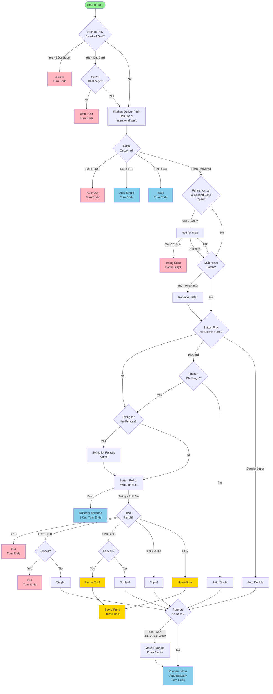

# Commons Baseball - Turn Sequence Flowchart

## Legend
- **Green**: Start of turn
- **Pink/Red**: Turn ends with out(s)
- **Light Blue**: Turn ends with runner(s) on base
- **Gold**: Turn ends with run(s) scored
- **Diamond shapes**: Decision points
- **Rectangles**: Actions/outcomes

## Notes
- Each turn follows this sequence from top to bottom
- Decision points (diamonds) determine the path through the flowchart
- Multiple paths can lead to the same endpoint
- Some actions are optional and some are conditional based on game state

